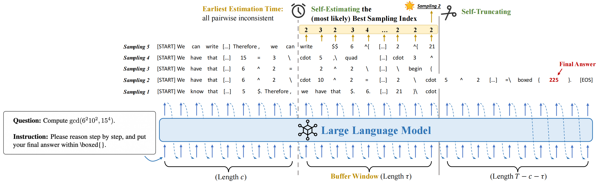

<h1 style="text-align: center;">
Sampling-Efficient Test-Time Scaling:

Self-Estimating the Best-of-$N$ Sampling in Early Decoding

(NeurIPS 2025 Spotlight)
</h1>

[](https://openreview.net/forum?id=BcKYVmh3yH)
[](https://arxiv.org/abs/2503.01422)
[](https://www.python.org/)
[](https://huggingface.co/docs/transformers/index)
[](https://www.apache.org/licenses/LICENSE-2.0)


This repository provides the official implementation of **ST-BoN** (Self-Truncation Best-of-$N$).
ST-BoN is an efficient parallel decoding method that **exploits early consistency among the model’s internal states to identify the most promising outputs and truncate suboptimal paths**, thereby avoiding the need to fully generate all $N$ samples and eliminating reliance on reward models.

<div align=center>
</img>
</div>

---


## Installation

1. **Clone the repository**

```bash
git clone <repo_url>
cd ST-BoN
```

2. **Create Python environment**

```bash
conda create -n stbon python=3.10
conda activate stbon
```

3. **Install dependencies**

```bash
pip install torch==2.8.0 torchvision==0.23.0 torchaudio==2.8.0 --index-url https://download.pytorch.org/whl/cu126
pip install -r requirements.txt
```


4. **Set the project path**

```bash
export PROJECT_PATH="/path/to/ST-BoN"
```

> Note: Make sure the `PROJECT_PATH` matches the root directory of this repository.


---

## Data & Model Setup

* **Datasets** should be placed in the `Data/` folder and follow the `.jsonl` format.
  Each line represents a single example as a JSON object containing at least the following keys:

```json
{
  "id": 0,
  "question": "Input text here",
  "answer": "Target answer"
}
```

* **Pre-trained models** are loaded via `Model/load_model.py`.

* **Adding new datasets or models:**
  You can extend the repository to support additional datasets or models by editing `support.py`.
  If you do not add your custom dataset or model here, `main.py` will not recognize it and the script will fail to run.


> Notes: When adding a new dataset or model, make sure the names match exactly in `support.py` and the CLI arguments.


---

## Usage


The decoding algorithms are implemented in `decoders.py`, which integrates three primary modes. These modes can be selected via the `--decoding_mode` argument when running `main.py`.


### 1. Greedy Decoding

```bash
python main.py \
    --model_name <model> \
    --dataset <dataset_name> \
    --decoding_mode greedy \
    --max_output_token 4096
```

* Standard left-to-right decoding.
* Outputs one deterministic answer per input.
* Does not require additional sampling parameters (`top_k`, `top_p`, etc.).


### 2. Self-Consistency Decoding

```bash
python main.py \
    --model_name <model> \
    --dataset <dataset_name> \
    --decoding_mode sc \
    --top_k 20 \
    --top_p 0.95 \
    --temperature_t 0.7 \
    --num_sample 40 \
    --max_output_token 4096
```

* Generates multiple (`num_sample`) output trajectories per input.
* The final answer is determined via **majority voting** among the sampled trajectories.
* Parameters specific to SC decoding:

  * `--top_k`: Top-K sampling for each token (default 20).
  * `--top_p`: Top-p (nucleus) sampling for each token (default 0.95).
  * `--temperature_t`: Softmax temperature controlling randomness (default 0.7).
  * `--num_sample`: Number of bootstrapped trajectories (default 40).


### 3. ST-BoN Decoding

```bash
python main.py \
    --model_name <model> \
    --dataset <dataset_name> \
    --decoding_mode stbon \
    --top_k 20 \
    --top_p 0.95 \
    --temperature_t 0.7 \
    --num_sample 40 \
    --tau_coeff 1.0 \
    --max_output_token 4096
```

* ST-BoN uses **early sampling consistency in the model’s internal states** to select the most promising paths and truncate suboptimal ones.
* Reduces the need to fully generate all $N$ samples while maintaining high output quality.
* Parameters specific to ST-BoN decoding:

  * All SC parameters (`top_k`, `top_p`, `temperature_t`, `num_sample`).
  * `--tau_coeff`: Temperature coefficient controlling the soft selection among trajectories (default 1.0).


### Command-Line Arguments Overview ```arguments.py```

| Argument                  | Description                          | Default               |
| ------------------------- | ------------------------------------ | --------------------- |
| `--model_name`            | Name or path of the model            | `Qwen2.5-7B-Instruct` |
| `--dataset`               | Dataset name                         | e.g., `MATH-500`      |
| `--max_output_token`      | Maximum tokens to generate per input | 4096                  |
| `--decoding_mode`         | `greedy` / `sc` / `stbon`            | `greedy`              |
| `--top_k`                 | Top-K sampling per token             | 20                    |
| `--top_p`                 | Nucleus sampling (Top-p) per token   | 0.95                  |
| `--temperature_t`         | Sampling temperature                 | 0.7                   |
| `--num_sample`            | Number of trajectories to generate   | 40                    |
| `--tau_coeff`             | ST-BoN soft selection temperature    | 1.0                   |
| `--print_model_parameter` | Print model modules and sizes        | False                 |

> Notes:
> * `greedy` mode ignores sampling parameters (`top_k`, `top_p`, `temperature_t`, `num_sample`, `tau_coeff`).
> * `sc` and `stbon` require sampling parameters; `stbon` additionally uses `tau_coeff`.


### Batch Script: ```scripts/llm_infer.sh```


* Supports multiple datasets (`dataset_list`) and multiple GPUs (`CUDA_VISIBLE_DEVICES`).
* Adjust `decoding_mode` to switch between `greedy`, `sc`, and `stbon`.
* The script automatically appends parameters relevant to the selected mode.


---


## Output Format

Generated outputs are saved in a structured folder hierarchy under the `Output/` directory:

```
Output/
├─ <model_name>/
│  ├─ <dataset_name>/
│  │  ├─ <decoding_mode>/
│  │  │  ├─ [sampling_subdir]/  # Optional, depending on mode
│  │  │  │  ├─ 0.jsonl
│  │  │  │  ├─ 1.jsonl
│  │  │  │  └─ ...
```

### Example Output JSON

```json id="yu9u9e"
{
  "id": 0,
  "question": "Input text here",
  "true_answer": "Ground truth answer",
  "predicted_answer": "Model output",
  "answer_type": "multiple-choice",
  "meta": {
    "output_length": 42,
    "inference_time": 0.12
  }
}
```

* `id`: unique sample ID
* `question`: input text or prompt
* `true_answer`: reference/ground truth answer
* `predicted_answer`: model-generated answer
* `answer_type`: optional, used in datasets like `theoremqa`
* `meta`: additional information about inference


### Meta Fields

**1. Greedy / SC Decoding**

```json
{
  "output_length": <length of generated output>,
  "inference_time": <time in seconds>
}
```


**2. ST-BoN Decoding**

```json
{
  "output_length": <final output length>,
  "inference_time": <total inference time>,
  "stage1_time": <stage1 runtime>,
  "stage2_time": <stage2 runtime>,
  "stage3_time": <stage3 runtime>,
  "c": <truncation coefficient>,
  "tau": <soft selection temperature>,
  "stop_step": <step at which truncation stopped>
}
```

---

## Evaluation


The `eval.py` collects all result JSON/JSONL files in a given folder and computes overall metrics, such as total samples, number of correct predictions, accuracy, and average inference time.
Optional flag `--save_detail` can store per-sample evaluation details in a single JSON file for further inspection.

**Example usage: ```Scripts/llm_eval.sh```**


* Automatically infers dataset, model, decoding mode, and sampling parameters from the folder structure.
* Provides a concise summary of the folder’s overall performance.


---


## Citation

If you use our ST-BoN or are inspired by our work, welcome to cite our paper and provide valuable suggestions.

```bibtex
@article{wang2025sampling,
  title={Sampling-efficient test-time scaling: Self-estimating the best-of-n sampling in early decoding},
  author={Wang, Yiming and Zhang, Pei and Huang, Siyuan and Yang, Baosong and Zhang, Zhuosheng and Huang, Fei and Wang, Rui},
  journal={arXiv preprint arXiv:2503.01422},
  year={2025}
}
```
